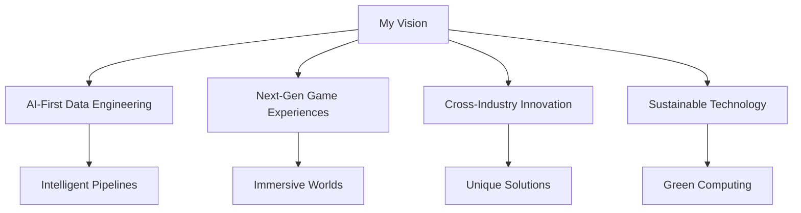

<div align="center">


</div>

<br>

<div align="center">

[](https://git.io/typing-svg)

</div>

<br>

<div align="center">

[](https://www.moeinghaeini.com/)
[](https://www.linkedin.com/in/moeinghaeini/)
[](mailto:moeinghaeini@gmail.com)
[](https://github.com/moeinghaeini)

</div>

---

## 🎯 About Me

<div align="center">

```python
class MoeinGhaeini:
    def __init__(self):
        self.name = "Moein Ghaeini"
        self.role = "AWS Cloud Data Engineer & Game Developer"
        self.education = "MSc Computer Science @ University of Milan"
        self.location = "Hamburg, Germany → Milan, Italy"
        self.passion = ["Cloud Architecture", "Game Development", "AI/ML", "Innovation"]
        
    def current_focus(self):
        return "Building AI-powered data platforms and immersive game experiences"
        
    def philosophy(self):
        return "The best solutions come from combining analytical thinking with creative problem-solving"
```

</div>

I'm currently pursuing my MSc in Computer Science at the University of Milan, where I've discovered my passion for **AWS cloud data engineering** and **game development**. I find myself constantly drawn to the intersection of scalable cloud infrastructure and creative digital experiences.

When I'm not architecting data pipelines on AWS, I'm crafting immersive game worlds and experimenting with interactive mechanics. I believe that the best solutions come from combining analytical thinking with creative problem-solving.

---

## 📊 GitHub Statistics

<div align="center">


</div>

---

## 🛠️ Tech Stack

<div align="center">

### ☁️ Cloud & Data Engineering


### 🎮 Game Development


### 🤖 AI & Machine Learning


</div>

---

## 🚀 What I'm Working On

<div align="center">

| Project Type | Status | Description |
|--------------|--------|-------------|
| 🏗️ **AI Data Platform** | 🚀 Active | Building scalable MLOps pipelines with AWS SageMaker |
| 🎮 **Game Development** | 🎯 In Progress | Creating immersive experiences with Unity & Unreal |
| ☁️ **Cloud Architecture** | 💡 Planning | Designing serverless solutions for real-time analytics |
| 🤖 **ML Research** | 🔬 Learning | Exploring generative AI and computer vision applications |

</div>

---

## 🎯 Goals & Vision

<div align="center">



</div>

I'm passionate about:
- **AI-First Data Engineering** – Building intelligent data pipelines that leverage machine learning and generative AI
- **Immersive Game Experiences** – Creating next-generation games that blend traditional gameplay with AI, VR/AR, and cloud technologies
- **Cross-Industry Innovation** – Finding unexpected connections between data engineering and game development
- **Sustainable Technology** – Building energy-efficient solutions that minimize environmental impact

---

## 📈 GitHub Activity

<div align="center">


</div>

---

## 🏆 Achievements

<div align="center">


</div>

---

## 🤝 Let's Connect

<div align="center">

### 💬 Get In Touch

[](https://www.moeinghaeini.com/)
[](https://www.linkedin.com/in/moeinghaeini/)
[](https://x.com/moeinghaeini)
[](mailto:moeinghaeini@gmail.com)

</div>

<div align="center">

### 🎮 Fun Fact

```python
while True:
    if coffee_level < 0.2:
        brew_coffee()
    if working_on_aws_project():
        architect_scalable_solution()
    if working_on_game():
        create_immersive_experience()
    if new_technology_emerges():
        learn_and_experiment()
```

**Thanks for taking the time to learn about my journey. I look forward to connecting with you!** 🚀


</div>

---

<div align="center">


</div>