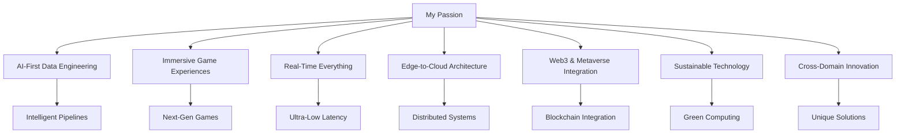

<div align="center">

# Hello, I'm Moein Ghaeini

*AWS Cloud Data Engineer • Game Developer • AI/ML Enthusiast*

[](https://www.moeinghaeini.com/)
[](https://www.linkedin.com/in/moeinghaeini/)
[](https://x.com/moeinghaeini)
[](mailto:moeinghaeini@gmail.com)

</div>

---

## About Me

<div align="center">

```python
class MoeinGhaeini:
    def __init__(self):
        self.name = "Moein Ghaeini"
        self.role = "AWS Cloud Data Engineer & Game Developer"
        self.education = "MSc Computer Science @ University of Milan"
        self.location = "Hamburg, Germany → Milan, Italy"
        self.passion = ["Cloud Architecture", "Game Development", "AI/ML", "Innovation"]
        
    def current_focus(self):
        return "Building AI-powered data platforms and immersive game experiences"
        
    def philosophy(self):
        return "The best solutions come from combining analytical thinking with creative problem-solving"
```

</div>

I'm currently pursuing my MSc in Computer Science at the University of Milan, where I've discovered my passion for **AWS cloud data engineering** and **game development**. I find myself constantly drawn to the intersection of scalable cloud infrastructure and creative digital experiences.

When I'm not architecting data pipelines on AWS, I'm crafting immersive game worlds and experimenting with interactive mechanics. I believe that the best solutions come from combining analytical thinking with creative problem-solving.

---

## GitHub Statistics

<div align="center">


</div>

---

## Technical Skills

<div align="center">

### Core Technologies


</div>

### AWS Cloud & Data Engineering

<div align="center">


</div>

- **AWS Core Services** – I architect solutions using S3, Lambda, SNS, EC2, RDS, Glue, CloudWatch, IAM, and EMR
- **AI/ML Integration** – I implement MLOps pipelines with SageMaker, Bedrock, and integrate generative AI for data processing
- **Serverless Architecture** – I leverage Lambda functions, API Gateway, and EventBridge for event-driven, cost-effective solutions
- **Infrastructure as Code** – I use Terraform and AWS CDK for consistent, version-controlled infrastructure management
- **Real-Time Analytics** – I build streaming pipelines with Kinesis, MSK, and implement real-time dashboards with QuickSight
- **Security & Compliance** – I implement zero-trust architectures, encryption at rest/transit, and ensure GDPR/HIPAA compliance

### 🔄 Data Engineering & Analytics

<div align="center">


</div>

- **Stream Processing** – I work with Apache Kafka, Apache Flink, and AWS Kinesis for real-time data streaming
- **Big Data Processing** – I use Apache Spark, Databricks, and AWS EMR for processing petabyte-scale datasets
- **Workflow Orchestration** – I design complex data workflows with Apache Airflow, Prefect, and AWS Step Functions
- **Data Mesh Architecture** – I implement decentralized data architectures for scalable, domain-driven analytics
- **Feature Engineering** – I build feature stores and implement automated feature pipelines for ML models

### 🤖 AI & Machine Learning

<div align="center">


</div>

- **MLOps & Model Deployment** – I implement end-to-end ML pipelines with SageMaker, MLflow, and Kubeflow
- **Generative AI** – I integrate LLMs, vector databases, and RAG systems for intelligent data processing
- **Computer Vision** – I develop CV models for image analysis and automated content generation
- **NLP & Text Analytics** – I build text processing pipelines and sentiment analysis systems
- **Model Monitoring** – I implement drift detection, performance monitoring, and automated retraining pipelines

### 🗃️ Modern Database Technologies

<div align="center">


</div>

- **Cloud-Native Databases** – AWS RDS, DynamoDB, Redshift, Aurora, and DocumentDB for managed solutions
- **Vector Databases** – Pinecone, Weaviate, and pgvector for AI/ML applications and similarity search
- **Time-Series Databases** – InfluxDB and TimescaleDB for IoT and real-time analytics
- **Graph Databases** – Neo4j and Amazon Neptune for relationship-heavy data modeling
- **Multi-Model Databases** – MongoDB Atlas and Couchbase for flexible data storage

### 👾 Game Development & Interactive Media

<div align="center">


</div>

- **Unity Engine** – I develop cross-platform games with Unity 2023+ and implement advanced rendering techniques
- **Unreal Engine 5** – I create high-fidelity experiences using Nanite, Lumen, and MetaHuman technologies
- **AI in Games** – I implement ML agents, procedural content generation, and adaptive AI using Unity ML-Agents
- **VR/AR Development** – I build immersive experiences for Meta Quest, Apple Vision Pro, and HoloLens
- **Game Analytics** – I integrate advanced analytics with PlayFab, GameAnalytics, and custom telemetry systems
- **Procedural Generation** – I use Houdini, Blender scripting, and custom algorithms for automated content creation

### 🌐 Emerging Technologies

<div align="center">


</div>

- **Web3 & Blockchain** – I integrate smart contracts, NFTs, and play-to-earn mechanics in games
- **Cloud Gaming** – I develop for AWS GameLift, Google Stadia, and Microsoft xCloud platforms
- **Edge Computing** – I implement edge solutions with AWS Wavelength and CloudFront for low-latency experiences
- **5G & IoT Integration** – I build connected experiences leveraging 5G networks and IoT data streams

### 💻 Programming Languages & DevOps

<div align="center">


</div>

- **Python** – My primary language for data engineering, ML, and automation with expertise in FastAPI, Pandas, and PyTorch
- **C# & .NET** – Game development, backend services, and cross-platform applications
- **TypeScript/JavaScript** – Full-stack web development and Node.js backend services
- **Rust** – High-performance systems programming and game engine development
- **SQL & NoSQL** – Advanced querying, optimization, and database design across multiple paradigms
- **DevOps & CI/CD** – Docker, Kubernetes, GitHub Actions, and GitLab CI for automated deployments
- **Infrastructure Monitoring** – Prometheus, Grafana, and AWS CloudWatch for comprehensive observability

---

## 🚀 What Drives Me

<div align="center">



</div>

I'm passionate about:

- **AI-First Data Engineering** – Building intelligent data pipelines that leverage machine learning and generative AI for automated insights
- **Immersive Game Experiences** – Creating next-generation games that blend traditional gameplay with AI, VR/AR, and cloud technologies
- **Real-Time Everything** – Implementing ultra-low-latency systems for gaming, IoT, and financial applications
- **Edge-to-Cloud Architecture** – Designing distributed systems that process data at the edge while maintaining cloud scalability
- **Web3 & Metaverse Integration** – Exploring how blockchain, NFTs, and virtual worlds can enhance both data systems and gaming
- **Sustainable Technology** – Building energy-efficient solutions that minimize environmental impact while maximizing performance
- **Cross-Domain Innovation** – Finding unexpected connections between data engineering and game development to create unique solutions

---

## 🎯 My Career Goals

<div align="center">

### 🎯 Current Focus Areas

| Goal | Status | Priority |
|------|--------|----------|
| Lead AI-Powered Data Platforms | 🚀 In Progress | High |
| Build the Future of Gaming | 🎮 Active | High |
| Pioneer Cross-Industry Innovation | 💡 Planning | Medium |
| Drive Sustainable Technology | 🌱 Learning | Medium |
| Mentor the Next Generation | 👥 Ready | High |

</div>

I'm actively seeking opportunities where I can:

- **Lead AI-Powered Data Platforms** – Architect next-generation data infrastructure that integrates MLOps, generative AI, and real-time analytics at enterprise scale
- **Build the Future of Gaming** – Develop immersive game experiences that leverage cloud computing, AI, VR/AR, and Web3 technologies
- **Pioneer Cross-Industry Innovation** – Create breakthrough solutions that bridge data engineering and game development for industries like healthcare, education, and entertainment
- **Drive Sustainable Technology** – Implement green computing practices and energy-efficient architectures in both cloud and gaming applications
- **Mentor the Next Generation** – Share knowledge and guide emerging engineers in cutting-edge technologies while building inclusive, diverse teams

---

## 📈 GitHub Activity

<div align="center">


</div>

---

## 🏆 Achievements & Certifications

<div align="center">


</div>

---

## 🤝 Let's Build Something Amazing Together

<div align="center">

### 📬 Get In Touch

[](https://www.moeinghaeini.com/)
[](https://www.linkedin.com/in/moeinghaeini/)
[](https://x.com/moeinghaeini)
[](mailto:moeinghaeini@gmail.com)
[](https://github.com/moeinghaeini)

</div>

<div align="center">

### 💬 Let's Connect!

Whether you're looking for an AWS data engineer, a game developer, or someone who can bridge both worlds, I'd love to hear from you. Let's create something extraordinary together!


</div>

---

<div align="center">

### 🎮 Fun Fact

```python
while True:
    if coffee_level < 0.2:
        brew_coffee()
    if working_on_aws_project():
        architect_scalable_solution()
    if working_on_game():
        create_immersive_experience()
    if new_technology_emerges():
        learn_and_experiment()
```

**Thanks for taking the time to learn about my journey. I look forward to connecting with you!** 🚀


</div>
